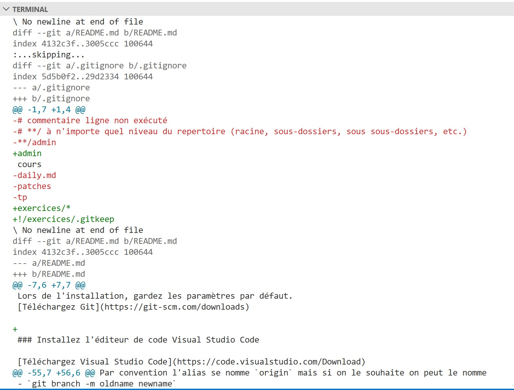
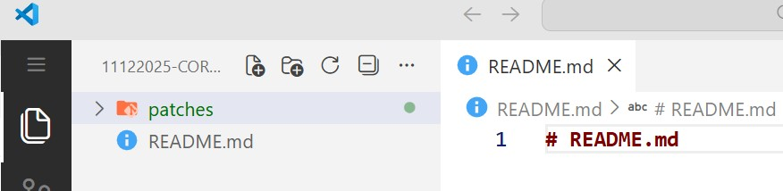

# Correction exercice 4.1 : travailler en équipe au jour le jour

## Partie I : commit

1. Question (Q) : A la suite de l'exercice 2.1, créez un fichier *README.md* contenant la liste des ingrédients de votre sandwich préféré, un ingrédient par ligne comme dans l'exemple ci-après.
- Réponse (R): [regarder le fichier README.md](./README.md)

2. Q : exécutez la commande `git status` pour voir l'état de votre dépôt. 
```bash
# R
git status
```
- Avec cette commande, on devrait voir que *git* détecte la création du nouveau fichier et vous indiquer de faire un `git add`

3. Q : effectuez votre premier commit avec la commande `git commit -m "first commit"`
- R : avant d'effectuer cette commande, il faut au préalable ajoute au moins un fichier dans l'index avec la commande `git add README.md`
```bash
# Cette commande fait un git add grâce à l'option -a et un commit
git commit -am "first commit" 
# Ou décomposer avec les commandes suivantes
git add .
git commit -m "first commit"
# git add . , avec le point, git ajoute tous les fichiers et dossiers du dossier courant dont le status est nouveau ou modifiés (ne prend pas en compte les fichiers traqués qui ont été supprimmés)
# Autres alternatifs
# - "git add README.md un_autre_fichier.txt un_dossier/", ici vous ajoutez vos fichiers et dossiers en le séparant par un espace
# - git add --all : ajoute tout, fichiers et dossiers dont le status est nouveau, modifié ou supprimé
``` 

4. Q : ajoutez une image de votre sandwich préféré dans le dossier */img* 
- R : ajout du lien vers le ficher [img/eiliv-aceron-mAQZ3X_8_l0-unsplash.jpg](./img/eiliv-aceron-mAQZ3X_8_l0-unsplash.jpg) dans le [README.md](README.md)

5. Q : regardez l'état de votre dépôt
```bash
# R
git status
``` 
- R : avec la commande précédente, vous devez voir que *README.md* a été modifié et que *git* détecte le nouveau fichier d'image

6. Q : effectuez un second commit avec un message court et clair de vos modifications.
```bash
# R
git commit -am "refactor: add sandwich image"
``` 
7. Q : ajoutez au moins 3 nouvelles photos, effectuez un commit par nouvelle photo.
```bash
# R
# 1ère modification du fichier physique README.md
git commit -am "refactor: update README.md"
# 2eme modification du fichier physique README.md
git commit -am "refactor: update(2) README.md"
# 3eme modification du fichier physique README.md
git commit -am "refactor: update(3) README.md"
``` 
- S'il n'y a pas de modification de votre dépôt et ni au moins un fichier dans l'index, la modification ne sera pas pris en compte.

---

## Partie II : tag

8. Q : utilisez la commande `git tag --help` pour voir la documentation de cette commande
```bash
# R
git tag --help
```
9. Ajoutez un nouveau ***tag v1.0.0*** associé au dernier commit
```bash
# R
git tag v1.0.0
```
10. Q : affichez la liste des tags.
```bash
# R
git tag --list
```
11. Q : créez un nouveau fichier burger.md avec la liste des ingrédients
- R : cf [burger.md](burger.md)
12. Q : effectuez un commit et créez un nouveau ***tag v1.1.0***
```bash
# R
git add burger.md
git commit -m "feat: add burder.md"
git tag v1.1.0
```
- Illustraction retour commande `git log --oneline`
```bash
$ git log --oneline
82bc471 (HEAD -> main, tag: v1.1.0) feat: add burger.md
01a8c5b (tag: v1.0.0) refactor: update(3) README.md
4e3b641 refactor: update(2) README.md
3b04545 refactor: update README.md
94abcef refactor: add sandwich image
12cd87d first commit
```
13.  Q : créez un dépôt distant sur *GitHub* et laissez-vous guider par les commandes de *GitHub* pour faire le lien avec votre dépôt distant et votre dépôt local.
- R : [vidéo création nouveau repository GitHub](../videos/create-new-repo.mp4)
```bash
# R : 2eme partie de la réponse avec le lien entre repo distant GitHub et votre dépôt local
git remote add origin https://github.com/glo10/new-repo-test.git # en remplaçant https://github.com/glo10/new-repo-test.git par l'URL de votre dépôt distant 
```

---

## Partie III : push/pull

14. Q : envoyez vos fichiers vers le dépôt distant à l'aide de la commande `git push`
```bash
# Si nécessaire, renommez la branche principale de master à main
git branch -M main
# Création de la branche distante main avec l'option -u car elle n'existe pas encore sur GitHub et envoie de la branche main local vers le distant 
git push -u origin main
```
15. Q : effectuez les modifications en ligne du fichier *README.md* depuis GitHub en ajoutant dans le *README.md* un sandwich végan et effectuez un commit
- R : [vidéo des actions à effectuer sur GitHub.com](../videos/update_from_github.mp4)
16. Q : récupérez les modifications effectuées en ligne en local à l'aide de la commande `git pull`
```bash
# R
git pull
```
17. Q : ouvrez le *README.md* et vérifiez que vous avez bel et bien le contenu du sandwich végan
- R : ouvrez README.md en local et vérifiez la présence des ingrédients du sandwich végan

---

## Partie IV : blame et diff

18. Q : comparez l'état de votre dépôt entre le premier et le dernier commit à l'aide des hashs associées à chaque commit à l'aide de la commande `git diff [HASH_PREIMIER_COMMIT] [HASH_DERNIER_COMMIT]`
```bash
# R ici remplacez les 2 hashs par les hashs de vos commit
git diff a0256be f886b02
```
- Extrait de `git diff`


19. Q : affichez les changements de manière plus détaillée du fichier *README.md*
```bash
# R
git diff a0256be f886b02 README.md
```

---

## Partie V : format-patch

20. Q: utilisez la commande `git format-patch HEAD -1 -o ./patches` pour extraire les changements du dernier commit dans un fichier *0001-[message-commit].patch* dans le dossier */patches/* (nouvellement crée)
```bash
# R
git format-patch HEAD -1 -o ./patches
```
- Allez dans le dossier [./patches](./pactches) pour voir le fichier généré par la commande précédente
21. Q : créez un nouveau dossier en dehors votre projet git encore et initialisez un nouveau projet git
- Attention à ne pas initialiser un dépôt git dans un autre dépôt git
```bash
# R 
pwd # pwd pour vérifier le dossier courant
cd /vers/le/nouveau/projet # Si nécessaire pour se déplacer dans le bon dossier
git init # Initialisation du nouveau projet git
```
22. Q : effectuez votre premier commit sur ce nouveau dépôt
- R : créez un fichier README.md et effectuez les commandes suivantes
```bash
# R
git add README.md
git commit -m 'first commit'
git branch -M main
```
23. Q : copiez/collez le dossier */patches/* du premier dépôt au second dépôt (à la racine du projet)
- R : illustration de l'arborescence des dossiers dans le nouveau projet git

24. Q : depuis le nouveau dépôt local, exécutez la commande `git am --3way ./patches`
```bash
git am --3way ./patches # option --3way en cas de conflit (ce sujet sera abordé plus tard)
```
25. Q : observez le résultat et regardez l'état de votre dépôt ainsi que l'historique des commandes
```bash
# R
git status
git log --oneline
```