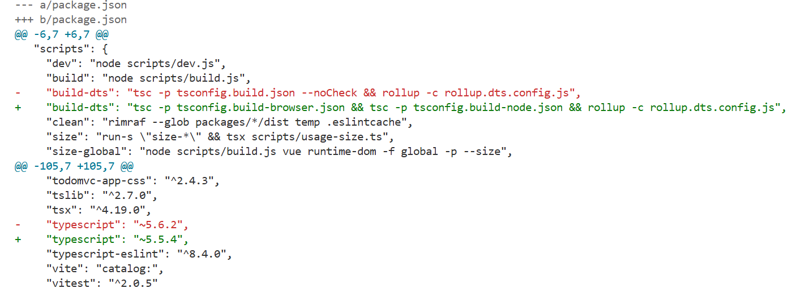

# Correction exercice 6.1 : compléments
# Exercice 6.1 : compléments

1. Q : reprenez [l'exercice 3.1](../3.1/) avec le clonage des framework ***Vue/core*** dont le lien du remote est [https://github.com/vuejs/core](https://github.com/vuejs/core).
- R : cf. [exercice 3.1](../../3.1.md)
2. Q : vous devez enquêter en utilisant la recherche dichotomique afin de trouver le premier commit qui a introduit la version 5.6 de TypeScript dans le framework.
Pour réaliser votre mission, vous allez devoir :
- Lire le contenu du fichier package.json à la racine du projet et vérifier la valeur de la version associée. Pour vérifier cette valeur, tapez la commande `cat package.json | egrep '"typescript"'` et vous verrez ce résultat 
```json
"typescript": "~5.5.4"
```
```bash
# R
cat package.json | egrep '"typescript"'
## Retour de cette commande  "typescript": "~5.6.2"
```
3. Q : commencez votre enquête en tapant cette commande `git bisect start 5e8898572fa63 c803e6a107d1bc`, ici les identifiants des commits permettent de cadrer notre intervalle
4. Q : recherchez la version de TypeScript en tapant `cat package.json | egrep '"typescript"'`
- Si le résultat contient la version ***5.6.\****, tapez la commande `git bisect good`
- Dans le cas inverse (le résultat ne contient pas ***5.6***), tapez `git bisect bad`
5. Q : répétez l'étape 4, jusqu'à ce que Git vous arrête et vous donne l'identifiant du premier commit ayant introduit TypeScript 5.6
```bash
# R 4 et 5
git bisect start 5e8898572fa63 c803e6a107d1bc
cat package.json | egrep '"typescript"'
git bisect good
cat package.json | egrep '"typescript"'
git bisect good
cat package.json | egrep '"typescript"'
git bisect bad
cat package.json | egrep '"typescript"'
git bisect good
cat package.json | egrep '"typescript"'
git bisect good
cat package.json | egrep '"typescript"'
git bisect good
cat package.json | egrep '"typescript"'
git bisect bad
cat package.json | egrep '"typescript"'
git bisect bad
cat package.json | egrep '"typescript"'
git bisect good
cat package.json | egrep '"typescript"'
# Le commit concerné que Git renvoie a l'ID b1db66a1a942b6b634b100183c3a8632c60c0c27 
```
6. Q : tapez la commande `git show package.json` pour voir l'intégralité du fichier à ce commit.
```bash
# R
git show package.json
# Ou
git diff b1db66a1a942b6b634b100183c3a8632c60c0c27 package.json
```
Résultat de la dernière commande `git show package.json`

7. Q : tapez la commande `git bisect log` pour voir toutes les étapes de votre recherche.
8. Q : tapez la commande `git bisect log > ../search_typescript_5.6.txt` pour stocker le résultat de la recherche dans un fichier afin de pouvoir l'effectuer à nouveau.
- Ici la question demande de créer le fichier `search_typescript_5.6.txt` en dehors du projet pour ne pas modifier l'état du dépôt une fois la recherche terminée, pour la correction ce fichier se trouvera à la racine
9. Q : quittez la recherche avec `git bisect reset`
```bash
# R 7, 8, 9 
# Pour les besoins de la correction, le fichier search_typescript_5.6.txt est crée au même niveau
git bisect log
git bisect log ./search_typescript_5.6.txt # export de la recherche pour rejouer ou modifier le scenario
git bisect reset # quitter la branche temporaire de recherche
```
10. Q : rejouez la recherche avec `git bisect replay ./search_typescript_5.6.txt`
```bash
# R
git bisect replay ./search_typescript_5.6.txt
```
- R cf. [ficher log de la recherche search_typescript_5.6.txt](./search_typescript_5.6.txt)