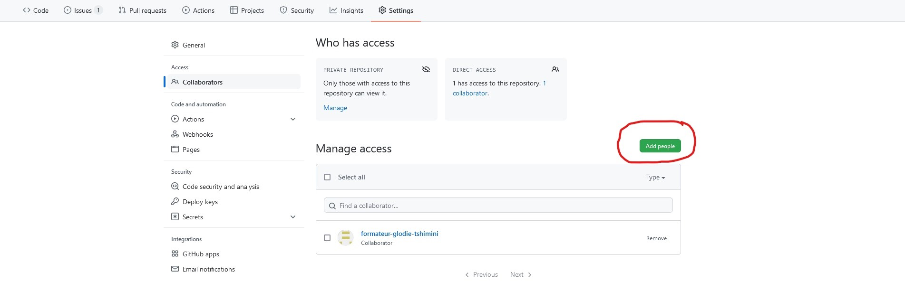

# TP validation des acquis : Ligue des champions 2025 - 2026

## Prérequis et recommandations

- Lisez dans son intégralité le sujet avant de commencer
- Respectez la convention de nommage [Angular](https://www.conventionalcommits.org/en/v1.0.0/)
- Commit et branches en Anglais
- Vous ne travaillez pas directement sur la branche *main*
- ***Dans votre réalisation, prenez un échantillon du calendrier, des équipes, du classement et des pronostics. Le seul fichier qui doit être complet, ce sont vos pronostics pour la prochaine journée des rencontres du 20/01/2026 (fichier pronostics/20012026.md)***

---

## Objectifs 

- [x] Le travail collaboratif en trinôme avec Git & GitHub
- [x] Commandes de base de Git
- [x] Gestion des conflits
- [x] La manipulation des branches locales & distantes
- [x] Les tags
- [x] L'application de patchs
- [x] La recherche par dichotomie

---

## Enoncé

Vous travaillez en binôme pour créer un dépôt Git contenant les fichiers Markdown décrivant la compétition **Ligue des Champions 2025–2026** :

Vous pouvez utiliser les données [d'EuroSport](https://www.eurosport.fr/football/ligue-des-champions/calendrier-resultats.shtml) pour extraire vos échantillons.
- `calendrier/` : dossiers contenant chaque journée nommée par sa date par exemple *26112025.md* et dont le contenu est le résultat ou le calendrier des matchs
- `pronostics/` : dossiers contenant vos pronostics de chaque journée nommée par la date par exemple *26112025.md* et dont le contenu est votre pronostic des matchs.
- `equipes/` : un fichier par équipe nommée par son par exemple *psg.md*
- `classements/` : dossiers contenant les classements, un fichier pour le classement des équipes et un autre pour les buteurs

---

### Partie I : création du dépôt par une seul personne du trinôme

1. Sur GitHub, créez un dépôt nommé : **champions-league-2025-2026**
2. Initialisez le dépôt avec un `README.md`.
3. Depuis ***Settings > Access > Collaborators > add people***, ajoutez les autres membres en tant que collaborateur à partir de leur pseudo sur GitHub et ajoutez le formateur dont le pseudo est *glo10*.

4. Acceptez l'invitation depuis l'e-mail envoyé par GitHub au compte associé à votre compte.
5. En local, **tout le monde clone le dépôt**.

---

# Partie II : création des fichiers en simultanée

1. Répartissez vous les tâches
- 1 collaborateur crée une nouvelle branche *feature/teams* pour créer les équipes
- 1 autre collaborateur crée une nouvelle branche *feature/calendar* pour créer les jours de compétition
- 1 autre collaborateur crée une nouvelle branche *feature/ranking* pour créer les classements
- **Tous les collaborateurs** font leurs pronostics dans une branche dédiée associée à leur prénom *feature/predications/votre-prenom* sans se concerter sur les scores.
2. Chaque collaborateur envoie ses modifications en ligne et demande à intégrer ces modifications dans la branche principale en demandant d'effectuer un pull request
3. Chaque collaborateur récupère au fur à mesure que les mises à jour sont effectuées sur le dépôt distant

---

## Partie III : résolution des conflits

1. Une fois que tout le monde a effectué ses pronostics, en local depuis un seul poste (un seul collaborateur fait la manipulation et les autres l'assistent), vous pouvez fusionner les branches *feature/predications/\** dans *main* et résoudre les conflits.
2. Toujours en local et toujours avec un seul collaborateur qui effectue les opérations, ajoutez un nouveau tag à votre projet avec la version *v1.0.0*.
3. Envoyez ce tag sur GitHub.

---

## Partie IV : application des patchs avec cherry-pick

1. Chaque collaborateur crée une nouvelle branche nommée *feature/the-winner/votre-prenom*
2. Dans cette branche, créez un dossier winners/
3. A l'intérieur de ce dossier, créez un fichier *[votre-prenom].md* contenant votre pronostic de l'équipe gagnante et effectuez un commit.
4. Chaque collaborateur applique cette modification dans *main* par l'utilisation de la commande `git cherry-pick`

---

## Partie V : introduction d'un bug dans le calendrier

---

## Partie VI : nettoyage

